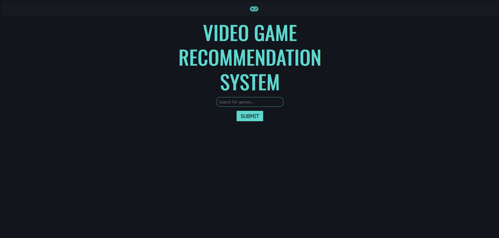
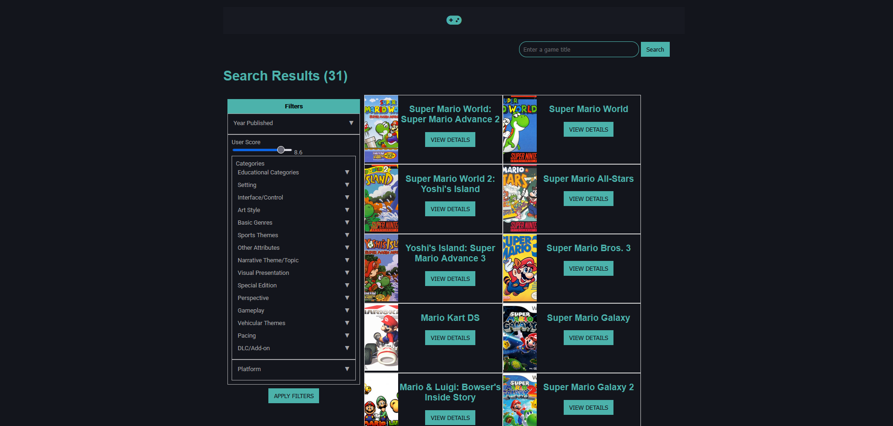

# Game Recommendation Website

Main page of the project

This project allows the user to input a game and recieve a list of recommendations based on that initial game 

## Motivation
This project was done as a part of our Software Engineering class. We decided on game recommendation as all three of us are fond of video games and wanted to see if we can make a more "objective" recommendation system (not based on other user recommmendations).

Demo Video showing the project's functionality

## Features

Search results for searching "mario" in the database 

- Shows recommendations of games based on inputted game
- Allows for filtering based on user score, dated published, categories, and platform
- Clicking on a game shows information related to the title such as score, description, and genres (provided from MobyGames) 

## Installation
- This project uses Java SE version 17 which can be downloaded [here](https://www.oracle.com/java/technologies/javase/jdk17-archive-downloads.html)
- MongoDb version 7.0.3 was used however any newer version of MongoDB should be used. Download MongoDB [here](https://www.mongodb.com/try/download/community-edition/releases/archive) 
- Download this project either by 
    - Downloading the source code as a zip and unzipping to your desired location
    - Using `git clone https://github.com/CS-4800-Group-Project/GameRecommendation.git`. Make sure you have [git](https://git-scm.com/downloads) installed
- The code does not come with the MongoDB database used, you must download the database from [MobyGames](https://www.mobygames.com/info/api/#non-commercial) **An API key is required**. Download the genre, platforms and games. The resulting jsons can just be placed in collections named GenreList, PlatformList and GameList (database named Game)
- Run `Application.java`

## Usage
- Simply navigate to localhost:8080 and input the name of the game you wish to search for
- To use filtering select the filters to apply and then "apply filters" at the bottom of the screen 

## Authors
BenLeCPP
LynnTaka
RannerJP
## License

This project uses the [GNU GPLv3](https://choosealicense.com/licenses/gpl-3.0/) license
